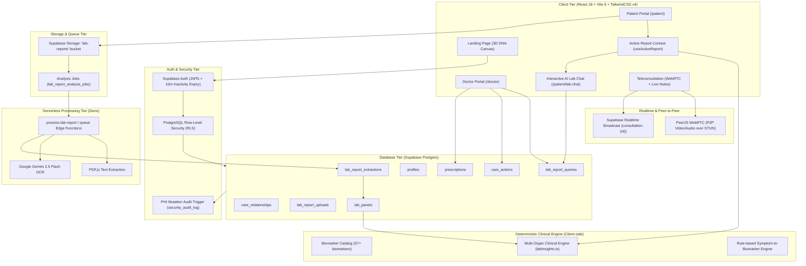

# 🦓 Zebra Synapse

<div align="center">

**AI-Assisted Clinical Intelligence, Longitudinal Biomarker Tracking & Teleconsultation Platform**

[](https://zebrasynapse.vercel.app/)
[](https://react.dev/)
[](https://www.typescriptlang.org/)
[](https://supabase.com/)
[](https://tailwindcss.com/)
[](https://ai.google.dev/)
[](https://peerjs.com/)

[**Explore Live Web Application**](https://zebrasynapse.vercel.app/) • [**Watch Demo Video**](https://youtu.be/xa0-ucu9rgE?si=y67QKcMFRMQ1W2ej) • [**Architecture**](./zebra-synapse/architecture.md) • [**Demo Guide**](./zebra-synapse/demo.md) • [**Codebase Map**](./zebra-synapse/docs/codebase.md) • [**Contributing**](./zebra-synapse/CONTRIBUTING.md)

</div>

---

## 📑 Table of Contents

- [Executive Summary & Problem Statement](#-executive-summary--problem-statement)
- [Key Capabilities & Feature Inventory](#-key-capabilities--feature-inventory)
- [System Architecture & Data Flow](#-system-architecture--data-flow)
- [Technology Stack](#-technology-stack)
- [Database Schema, Migrations & Security](#-database-schema-migrations--security)
- [Repository & Directory Structure](#-repository--directory-structure)
- [Local Setup & Development](#-local-setup--development)
- [Deployment Guide](#-deployment-guide)
- [Quality Assurance & Operations](#-quality-assurance--operations)
- [Demo Credentials & Evaluation Flow](#-demo-credentials--evaluation-flow)
- [Implementation Status & Boundaries](#-implementation-status--boundaries)
- [Attributions & License](#-attributions--license)

---

## 💡 Executive Summary & Problem Statement

### The Problem
1. **Clinical Lab Data Silos:** Diagnostic reports are trapped in unstructured, heterogeneous PDFs with non-standardized reference ranges. Patients struggle to understand their results, while clinicians spend excessive consultation time manually hunting for historical trends.
2. **Disconnected Care Workspaces:** Conventional patient portals lack synchronous, shared clinical context. Doctors lack unified tools to simultaneously review trends, author prescriptions, track care actions, and conduct live teleconsultations.
3. **AI Hallucination Risk in Healthcare:** Generic LLMs frequently hallucinate when interpreting clinical data or generating medical advice.

### The Zebra Synapse Solution
Zebra Synapse bridges this divide with an end-to-end clinical platform grounded in strict separation of concerns:
- **Generative AI (Google Gemini 2.5 Flash):** Restricted *strictly* to document parsing/OCR and conversational patient explanations grounded in extracted lab metrics.
- **Deterministic Clinical Engine (`labInsights.ts`, `biomarkerCatalog.ts`):** Multi-organ risk scoring, disease predictions, nutrition planning, and trial searches are computed *exclusively* via deterministic TypeScript algorithms grounded in clinical standards.
- **Clinician-in-the-Loop Verification:** Conversational AI responses provided to patients are asynchronously queued for doctor review (`lab_report_queries`), allowing clinicians to verify or revise answers with custom clinical notes.

---

## 🌟 Key Capabilities & Feature Inventory

### 🧑‍⚕️ 1. Patient Portal
- **Longitudinal Dashboard (`PatientHome.tsx`):** Health status score, risk indicators, recent biomarker badges (`normal`, `borderline`, `high`, `low`), active prescriptions, and care action feed.
- **Medical Records & Uploads (`MedicalRecordsInsights.tsx`):** Drag-and-drop PDF report upload, real-time extraction progress, Recharts longitudinal biomarker trend charts, and extraction draft inspector.
- **Active Report Switching (`useActiveReport.ts`):** Session-persisted report selection dropdown that instantly switches clinical context across all insight screens.
- **Interactive AI Lab Report Chat (`PatientLabChat.tsx`):**
  - Empathetic conversational assistant answering symptom questions grounded directly in the active report (e.g. explaining how low potassium and B12 cause dizziness).
  - Speech-to-text voice input via Web Speech API (`webkitSpeechRecognition`).
  - Interactive 3D glowing robot mascot with animated micro-interactions.
  - Collapsible chat session sidebar (`ChatSessionSidebar.tsx`) with search, filter, history clearing, and token tracking.
  - Real-time verification badges: **"Awaiting Doctor Verification"**, **"Doctor Verified"**, and **"Doctor Revised"**.
- **Deterministic Health Insights:**
  - *Disease Prediction (`DiseasePredictionInsights.tsx`):* Risk scoring for Diabetes, Cardiovascular Disease, Anemia, CKD, and Liver dysfunction.
  - *Personalized Nutrition (`NutritionInsights.tsx`):* Dietary and micronutrient guidance matched to biomarker imbalances.
  - *Clinical Trials Matching (`ClinicalTrialsInsights.tsx`):* Dynamic matching of ClinicalTrials.gov studies tailored to lab abnormalities.
  - *Wellness Tips (`WellnessTipsInsights.tsx`):* Actionable lifestyle, recovery, and hydration recommendations.
  - *Vitals Tracking (`VitalsInsights.tsx`):* Real-time vitals records and baseline trends.
- **Prescriptions (`Prescription.tsx`):** Doctor-authored medications, dosage schedules, and refill statuses.

### 🩺 2. Clinician (Doctor) Workspace
- **Patient Roster (`PatientsList.tsx`):** Searchable, filterable patient roster with real-time risk indicators and patient linking dialog (`LinkPatientDialog.tsx`).
- **Deep Patient Chart (`PatientDetail.tsx`):**
  - Historical lab panels and longitudinal biomarker trend visualizations.
  - Electronic prescription authoring modal (`src/lib/prescriptions.ts`).
  - Care action timeline: notes, referrals, follow-ups, and lab requests (`src/lib/careActions.ts`).
  - AI lab report extraction draft review and one-click publishing tool.
  - **AI Query Verification Queue:** Review patient AI questions, verify them with one click, or replace them with custom clinical explanations.

### 📹 3. Virtual Teleconsultation
- **WebRTC Video Calls (`VideoCall.tsx`):** Peer-to-peer audio/video streaming via PeerJS over Google STUN servers with full controls (mute, camera toggle, hang up).
- **Live Clinical Note Streaming (`RealtimeNote.tsx`):** Clinicians author consultation notes that stream in real time to the patient's screen via Supabase Realtime WebSocket broadcast channels (`consultation-{id}`).

### 🧬 4. 3D Visual Experience
- **Interactive DNA Double Helix (`DnaCanvas3D.tsx`):** Three.js / React Three Fiber 3D hero rendering with GSAP scroll-triggered unzipping animation on the landing page.

---

## 🏗️ System Architecture & Data Flow



---

## 💻 Technology Stack

| Layer | Technology | Purpose |
| :--- | :--- | :--- |
| **Frontend** | React 18, Vite 6, TypeScript 5.7 | Core single-page web application |
| **Styling & UI** | TailwindCSS v4, shadcn/ui, Lucide Icons | Dark glassmorphic design system |
| **3D & Animations** | Three.js, React Three Fiber, GSAP ScrollTrigger | 3D DNA helix canvas & unzipping animations |
| **Data Viz** | Recharts | Longitudinal biomarker charts |
| **Backend & DB** | Supabase Postgres (PostgreSQL 15+) | Relational clinical database with RLS |
| **Authentication** | Supabase Auth | JWT sessions, role guards, 15-min timeout |
| **File Storage** | Supabase Storage | Encrypted PDF lab report storage (`lab-reports`) |
| **Serverless Edge** | Deno Runtime Edge Functions | Asynchronous document OCR & parsing |
| **AI / OCR** | Google Gemini 2.5 Flash, PDF.js | Schema-guided biomarker extraction & AI Chat |
| **Teleconsultation** | PeerJS (WebRTC), Supabase Realtime | P2P video & real-time WebSocket note streaming |

---

## 🗄️ Database Schema, Migrations & Security

### Relational Data Model (8 Primary Tables across 14 Core Migrations)

| Table Name | Description | Key Security & Constraints |
| :--- | :--- | :--- |
| `public.profiles` | User identity, roles (`patient`, `doctor`), license numbers | RLS: Users access own; linked doctors access patient profile |
| `public.care_relationships` | Doctor-patient links & shared clinical snapshot | RLS: Participants only; status constraints |
| `public.prescriptions` | Doctor-authored medication records | RLS: Patient read-only; doctor authoring |
| `public.lab_report_uploads` | Uploaded lab report file metadata | RLS: Owner patient & linked doctors; storage sync |
| `public.lab_report_extractions`| AI extraction drafts with field confidence scores | RLS: Patient & linked doctor review |
| `public.lab_panels` | Published, structured biomarker records (57+ metrics) | RLS: Patient & linked doctors; immutable rows |
| `public.care_actions` | Timeline of notes, follow-ups, referrals, lab requests | RLS: Linked doctor authoring; patient visibility |
| `public.lab_report_queries` | AI chat inquiries, AI responses, and doctor review status | RLS: Patient insert/select/delete; linked doctor update |

### Ordered Migration Sequence
Apply migrations in numerical order from [`zebra-synapse/supabase/migrations/`](./zebra-synapse/supabase/migrations/):
1. `001_profiles.sql` — User profiles & role definitions
2. `002_care_relationships.sql` — Doctor-patient relationships & vitals snapshots
3. `003_prescriptions.sql` — Doctor-authored prescriptions
4. `004_lab_reports.sql` — Lab report upload tracking
5. `005_lab_panels.sql` — Structured biomarker panels
6. `006_lab_panel_biomarkers.sql` — Extended biomarker schema columns
7. `007_profiles_select_linked_users.sql` — Cross-profile select policies
8. `008_care_actions.sql` — Clinical care action timeline
9. `009_security_hardening.sql` — Strict RLS & PHI mutation audit logging trigger
10. `010_security_invariants.sql` — Immutability constraints & storage namespace enforcement
11. `014_lab_report_analysis_pipeline.sql` — Serverless analysis queue & extractions
12. `015_fix_link_patient_rls.sql` — Doctor-patient linking policy fixes
13. `016_lab_report_queries.sql` — Lab report AI chatbot queries & doctor verification
14. `017_lab_report_queries_delete_policy.sql` — Session query history clearance policy
15. *(Optional Seed)* `seed_doctors_patients.sql` — Populates demo doctors, patients, care links, and historical lab panels

### Security & Privacy Baseline
- **Row-Level Security (RLS):** Enabled and forced across all PHI tables.
- **Mutation Auditing:** Database trigger `audit_phi_mutation()` automatically logs every `INSERT`, `UPDATE`, and `DELETE` on PHI tables into `security_audit_log` with before/after JSON payloads.
- **Storage Isolation:** Path-based namespace enforcement (`{patient_id}/*`) ensures patients cannot access or upload files into another patient's folder.
- **Session Protection:** Configurable 15-minute inactivity session expiry (`VITE_AUTH_INACTIVITY_TIMEOUT_MS`).

---

## 📁 Repository & Directory Structure

```text
.
|-- README.md                    Master project overview and documentation
|-- vercel.json                  Root build forwarding configuration
|-- .github/                     CI workflows and PR templates
`-- zebra-synapse/               Sole product root
    |-- src/                     Application source code
    |   |-- app/                 Pages, routes, layouts, and components
    |   |   |-- pages/           Patient, Doctor, Auth, and Welcome views
    |   |   |-- components/      UI primitives, 3D DNA canvas, teleconsult
    |   |   `-- layouts/         Role-based route guards
    |   |-- auth/                AuthContext, session state, inactivity tracking
    |   |-- hooks/               Data hooks (usePatientLabReports, useActiveReport, etc.)
    |   |-- lib/                 Clinical engines (labInsights, biomarkerCatalog, labReportChat)
    |   `-- styles/              TailwindCSS v4 design tokens and global styles
    |-- public/                  Static web assets and demo files
    |-- supabase/                PostgreSQL migrations and serverless functions
    |   |-- functions/           Deno Edge Functions (process-lab-report, queue)
    |   `-- migrations/          15 SQL migrations defining schema, RLS, triggers
    |-- docs/                    Codebase navigation map and attributions
    |-- research/                Archived multimodal ML training scripts (MIMIC-IV)
    |-- screenshots/             Submission imagery and UI captures
    |-- package.json             Dependencies and build scripts
    |-- architecture.md          Canonical system architecture reference
    |-- demo.md                  Judge evaluation and demo walkthrough
    `-- CONTRIBUTING.md          Contribution and pull request guidelines
```

---

## 🚀 Local Setup & Development

### 1. Prerequisites
- **Node.js:** `20.19.0` (managed via Volta or nvm)
- **npm:** `11.6.2`
- **Supabase CLI:** `2.84.10`
- **Docker Desktop:** (optional, for local Supabase containers)

### 2. Installation
```bash
# 1. Clone the repository
git clone https://github.com/AmiteshBhardwaj/Zebra_Synapse.git
cd Zebra_Synapse/zebra-synapse

# 2. Install dependencies
npm install

# 3. Configure environment variables
cp .env.example .env
```

### 3. Environment Variables (`.env`)
```env
# Supabase Configuration
VITE_SUPABASE_URL=https://<your-project-ref>.supabase.co
VITE_SUPABASE_ANON_KEY=eyJhbGciOi...

# AI & OCR (Optional: enables Gemini API for document OCR & AI Chat)
VITE_GEMINI_API_KEY=AIzaSy...

# Optional Customizations
VITE_SITE_URL=http://localhost:5173
VITE_AUTH_INACTIVITY_TIMEOUT_MS=900000
```

> [!TIP]
> If `VITE_GEMINI_API_KEY` is not provided, Zebra Synapse automatically activates its built-in offline clinical inference engine for both lab report queries and symptom explanations.

### 4. Database Initialization
Apply all migrations in numeric sequence (001–017) against your Supabase instance, or run:
```bash
npm run setup:local
```

### 5. Launch Development Server
```bash
npm run dev
```

---

## 🌐 Deployment Guide

### Vercel Deployment
1. Import repository into Vercel.
2. Set **Root Directory** to `zebra-synapse`.
3. Configure Build Settings:
   - Install Command: `npm ci`
   - Build Command: `npm run build`
   - Output Directory: `dist`
4. Set Environment Variables in Vercel:
   - `VITE_SUPABASE_URL`
   - `VITE_SUPABASE_ANON_KEY`
   - `VITE_GEMINI_API_KEY` (optional)
   - `VITE_SITE_URL` (e.g. `https://zebrasynapse.vercel.app`)

### Supabase Edge Functions Deployment
```bash
supabase secrets set GEMINI_API_KEY=<your-api-key>
supabase secrets set GEMINI_MODEL=gemini-2.5-flash
supabase secrets set GEMINI_MODEL_FALLBACK=gemini-2.5-flash-lite

supabase functions deploy process-lab-report
supabase functions deploy process-lab-report-queue
```

---

## 🧪 Quality Assurance & Operations

Execute automated checks before submitting changes:
```bash
# Type check TypeScript codebase
npm run typecheck

# Production build bundle check
npm run build

# Comprehensive verification (typecheck + build)
npm run check
```

---

## 🎯 Demo Credentials & Evaluation Flow

**Shared Demo Password:**
```text
SeedPassword123!
```

### Seed Accounts
| Role | Email | Name | Context |
| :--- | :--- | :--- | :--- |
| **Doctor** | `zebra-seed-doctor-1@example.test` | Dr. Amelia Hart | Primary Care Physician (linked to Maya Thompson) |
| **Doctor** | `zebra-seed-doctor-2@example.test` | Dr. Benjamin Ortiz | Cardiologist / Internal Medicine |
| **Patient** | `zebra-seed-patient-1@example.test` | Maya Thompson | 2 Published Lab Panels (`cn2.pdf`, CMP) |
| **Patient** | `zebra-seed-patient-3@example.test` | Sofia Bennett | Longitudinal Panel Data (Cardio risk) |

### 5-Minute Evaluator Walkthrough
1. **Interactive 3D Landing:** Explore the Three.js 3D DNA Helix canvas and scroll-triggered unzipping animation at [`/`](https://zebrasynapse.vercel.app/).
2. **Patient Experience:** Sign in as `zebra-seed-patient-1@example.test` -> View dashboard -> Inspect medical records & active report switching -> Explore multi-organ disease risk scores, nutrition plans, and ClinicalTrials.gov matches.
3. **AI Lab Report Chat:** Open **AI Lab Chat (`/patient/lab-chat`)** -> Ask *"Why do I feel dizzy and weak?"* -> Review grounded biomarker explanation linking symptoms to low potassium, calcium, and B12 -> Notice **"Awaiting Doctor Verification"** badge.
4. **Doctor Verification Workflow:** Sign in as `zebra-seed-doctor-1@example.test` -> Open Maya Thompson's chart -> Review her query -> Click **"Verify"** (or provide custom revision notes) -> Author a prescription.
5. **Live Teleconsultation:** Open **Teleconsultation** on both portals -> Join WebRTC video call -> Watch doctor type clinical notes streamed in real-time to the patient's screen via WebSockets.

---

## 📊 Implementation Status & Boundaries

| Feature Area | Status | Technical Details |
| :--- | :--- | :--- |
| **Auth, Profiles, Linking, Prescriptions, Lab Pipeline, Care Actions, Audit Log** | **100% Production-Baked** | Backed by Supabase Postgres tables, RLS policies, triggers, and Edge Functions. |
| **Biomarker Catalog & Insights Engine** | **100% Production-Baked** | Pure TypeScript engines (`biomarkerCatalog.ts`, `labInsights.ts`) with 57+ catalog metrics. |
| **Interactive AI Lab Chat & Doctor Verification** | **100% Production-Baked** | Backed by `lab_report_queries` table, Gemini 2.5 API + offline clinical fallback engine, voice recognition, and doctor review loop. |
| **Teleconsultation Video & Live Notes** | **100% Functional Client Realtime** | PeerJS WebRTC P2P video stream + Supabase Realtime WebSocket broadcast channels. |
| **Appointments Scheduling** | **Local Component State Only** | Doctor choices & appointment bookings use React `useState` (`doctorOptions`), not a DB table. |
| **Rare Disease ML Training** | **Research Archive Only** | `research/ml/` contains Python scripts training MIMIC-IV classifiers; exported to `rare_disease_screen_v1.json`, separate from web runtime. |
| **Demo Auth Mode** | **Offline Fallback** | `AuthContext.tsx` uses `localStorage` demo sessions if Supabase environment variables are unconfigured. |

---

## 📄 Attributions & License

- **UI Primitives:** Built using [shadcn/ui](https://ui.shadcn.com/) components under the [MIT License](https://github.com/shadcn-ui/ui/blob/main/LICENSE.md).
- **Visuals & Photography:** Media from [Unsplash](https://unsplash.com) under the [Unsplash License](https://unsplash.com/license).
- **Icons:** [Lucide React](https://lucide.dev/) icons under the [ISC License](https://github.com/lucide-icons/lucide/blob/main/LICENSE).
- **License:** Zebra Synapse is released under the [MIT License](./LICENSE).

<div align="center">

**Built for modern, transparent, and collaborative healthcare.**

</div>
