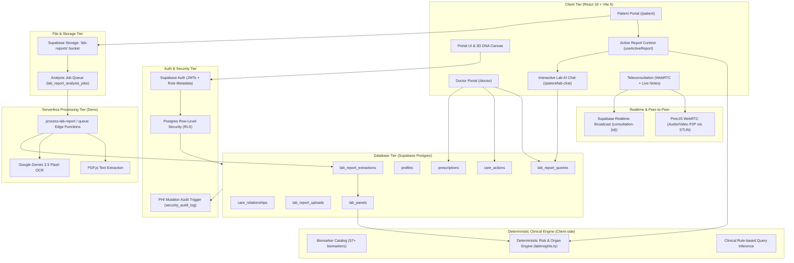

# System Architecture

This document is the canonical system-design reference for **Zebra Synapse**. Setup, deployment, and operations stay in [`../README.md`](../README.md). Supplementary development notes stay in [`docs/codebase.md`](./docs/codebase.md).

---

## 1. System Overview

Zebra Synapse is a single-page React application backed by Supabase. It unifies patient and clinician workspaces, server-side PDF lab report OCR, structured biomarker persistence, deterministic clinical risk modeling, an interactive AI Lab Report Chatbot with doctor verification, and virtual teleconsultation channels.

---

## 2. Core Architectural Layers

### 1. Presentation & Interaction Layer
- **Framework:** React 18, TypeScript, Vite 6, TailwindCSS v4.
- **Visuals & 3D:** Three.js / React Three Fiber interactive 3D DNA double helix canvas with GSAP scroll-triggered unzipping animation on landing.
- **Charts:** Recharts for longitudinal biomarker tracking across patient encounters.
- **Active Report State:** `useActiveReport` hook persists active report IDs in `sessionStorage` and unifies report context across all patient insight views.

### 2. Authentication & Authorization Layer
- **Identity:** Supabase Auth handling email/password registration with strict validation (minimum 12 chars, upper/lower/number/special).
- **Role Routing:** Route guards (`RequirePatientPortal`, `RequireDoctorPortal`) ensure patients cannot access doctor endpoints and vice-versa.
- **Inactivity Timeout:** Automatic session teardown after 15 minutes of user inactivity (`VITE_AUTH_INACTIVITY_TIMEOUT_MS`).

### 3. Asynchronous Lab Extraction Pipeline
1. **Upload:** User uploads a PDF lab report via `MedicalRecordsInsights.tsx`.
2. **Storage:** Stored in the `lab-reports` bucket under `{patient_id}/{upload_id}.pdf`.
3. **Queue:** Database trigger inserts a job into `lab_report_analysis_jobs`.
4. **Edge Function:** Deno function `process-lab-report` retrieves file bytes, extracts text via `pdfjs-dist`, and prompts Google Gemini 2.5 Flash with structured JSON schemas.
5. **Draft & Confidence:** Structured results with confidence scores and source text snippets persist into `lab_report_extractions`.
6. **Publishing:** Validated extractions auto-publish into `lab_panels` for immediate clinical consumption.

### 4. Interactive AI Lab Report Chat & Clinician Verification Loop
- **Conversational UI:** `PatientLabChat.tsx` with 3D glowing robot mascot, voice input (Web Speech API), and collapsible chat history sidebar (`ChatSessionSidebar.tsx`).
- **Context Synthesis:** Gathers active report biomarkers, reference ranges, abnormality flags, and raw PDF snippets.
- **Hybrid Response Generation (`labReportChat.ts`):**
  - Uses Google Gemini 2.5 Flash API when configured with structured clinical prompting.
  - Automatically falls back to a deterministic, symptom-to-biomarker clinical inference engine covering dizziness, fatigue, cramps, palpitations, jaundice, renal, and metabolic conditions.
- **Clinician-in-the-Loop:** Every patient query is persisted to `lab_report_queries` with `status: 'pending_review'`. Connected doctors can review patient queries, mark them `verified`, or `rejected_and_replaced` with custom clinical instructions.

### 5. Deterministic Clinical Insights Engine
- **Zero Hallucination Clinical Logic:** Clinical interpretations, organ system evaluations, disease risk predictions, and nutrition plans are computed client-side by deterministic rule engines (`biomarkerCatalog.ts`, `labInsights.ts`).
- **Biomarker Catalog:** 57+ standardized biomarkers with reference ranges, unit normalization, severity thresholds, and organ system mappings (Cardiovascular, Hematologic, Hepatic, Renal, Metabolic, Endocrine).
- **Clinical Trials Matching:** Generates dynamic search queries matching abnormal biomarkers against active ClinicalTrials.gov protocols.

### 6. Virtual Teleconsultation & Realtime Notes
- **Video/Audio Stream:** PeerJS WebRTC peer-to-peer connection over Google STUN servers.
- **Real-Time Clinical Note Streaming:** Clinicians author live consultation notes streamed instantaneously to the patient via Supabase Realtime WebSocket broadcast channels (`consultation-{id}`).

---

## 3. Relational Data Model (Supabase Postgres)

| Table Name | Description | Key Security & Constraints |
| :--- | :--- | :--- |
| `public.profiles` | User identity and role (`patient`, `doctor`) | RLS: users view own; linked doctors view patient profile |
| `public.care_relationships` | Doctor-patient clinical links and vitals | RLS: participants only; status tracking |
| `public.prescriptions` | Doctor-authored medication records | RLS: patient read-only; doctor authoring |
| `public.lab_report_uploads` | Uploaded lab report file metadata | RLS: owner patient & linked doctors; storage sync |
| `public.lab_report_extractions` | AI extraction drafts & field confidence | RLS: patient & linked doctor review |
| `public.lab_panels` | Published, structured biomarker records | RLS: patient & linked doctors; immutable data rows |
| `public.care_actions` | Timeline of notes, follow-ups, referrals | RLS: linked doctor authoring; patient visibility |
| `public.lab_report_queries` | AI chat queries, answers & doctor review | RLS: patient insert/select/delete; linked doctor update |

---

## 4. End-to-End User Journeys

### Patient Journey
1. Signs in -> View health score, risk indicators, and recent biomarker badges on `PatientHome`.
2. Uploads new lab report PDF on `MedicalRecordsInsights`.
3. Edge Function parses document -> Draft extractions auto-published to `lab_panels`.
4. Explores multi-organ assessments (`DiseasePrediction`, `Nutrition`, `ClinicalTrials`, `WellnessTips`).
5. Opens `PatientLabChat` -> Asks "Why do I feel dizzy?" -> Receives instant grounded clinical answer linking symptoms to low potassium and B12 -> Sees "Awaiting Doctor Verification" badge.
6. Joins virtual video consultation on `PatientTeleconsult` -> Watches doctor type live clinical notes.

### Doctor Journey
1. Signs in -> Views assigned patient roster on `PatientsList`.
2. Selects patient -> Opens `PatientDetail` chart.
3. Reviews longitudinal biomarker trends (Recharts) and historical lab reports.
4. Authors new electronic prescription and logs clinical follow-up actions.
5. Reviews pending patient AI queries -> Verifies accuracy or provides clinical replacement note.
6. Initiates teleconsultation video call on `DoctorTeleconsult` -> Streams live prescription and consultation notes to the patient.

---

## 5. Security & Compliance Architecture

- **Row-Level Security (RLS):** All clinical tables enforce strict RLS policies (`009_security_hardening.sql`).
- **Mutation Auditing:** Database trigger `audit_phi_mutation()` captures every modification on PHI tables into `security_audit_log` with full before/after snapshots.
- **Storage Isolation:** Path-based namespace enforcement (`{patient_id}/*`) ensures patients cannot access or upload files into another patient's directory.
- **Client Safety:** All database communication occurs via client anon keys with RLS; service role credentials are never exposed.
